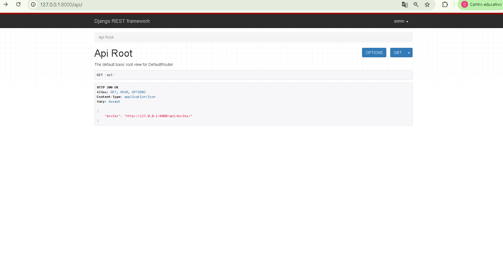
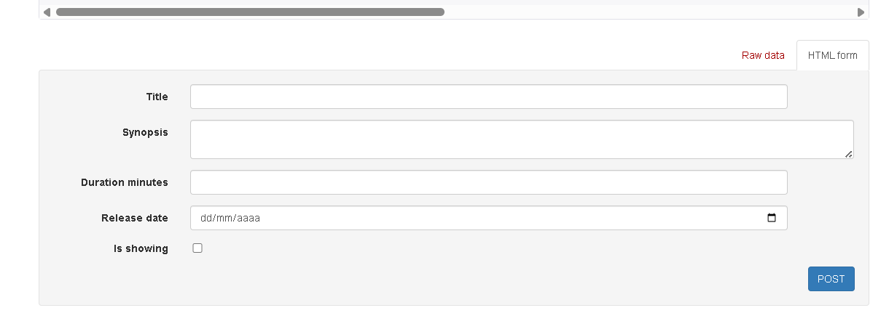
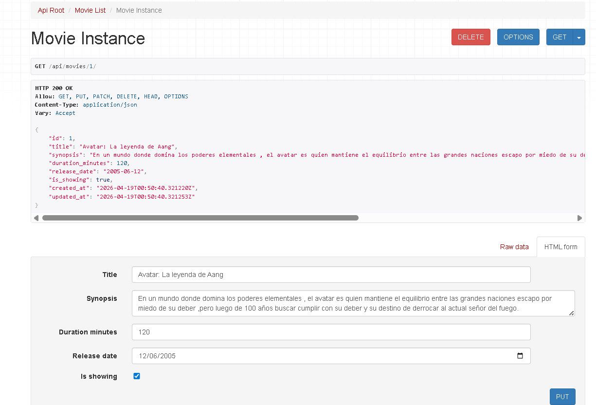
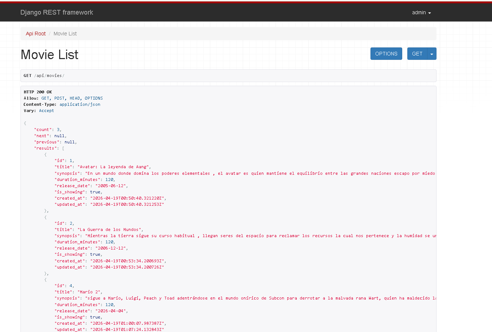

# 🎬 Cinespoiler API

API REST desarrollada con **Django** y **Django REST Framework** para la gestión básica de películas en un sistema de cine.  
El proyecto sigue una estructura simple, limpia y escalable, pensada como base para seguir creciendo con nuevos módulos y funcionalidades.

---

## 📖 Descripción

**Cinespoiler API** es un backend que permite administrar películas mediante operaciones CRUD.

Actualmente el sistema permite:

- registrar películas
- listar películas
- consultar el detalle de una película
- actualizar películas
- eliminar películas
- gestionar registros desde Django Admin
- consumir la API desde la interfaz navegable de Django REST Framework

---

## 🚀 Tecnologías utilizadas

- Python
- Django
- Django REST Framework
- SQLite
- Git
- GitHub

---

## 🖼️ Capturas del proyecto

### API Root


### Formulario de registro de películas


### Edicion de peliculas


### Listado de películas


---

## 📂 Estructura principal del proyecto

```bash
Cinespoiler/
├── .gitignore
├── manage.py
├── README.md
├── requirements.txt
├── config/
│   ├── __init__.py
│   ├── asgi.py
│   ├── settings.py
│   ├── urls.py
│   └── wsgi.py
└── movies/
    ├── __init__.py
    ├── admin.py
    ├── apps.py
    ├── migrations/
    ├── models.py
    ├── serializers.py
    ├── tests.py
    ├── urls.py
    └── views.py