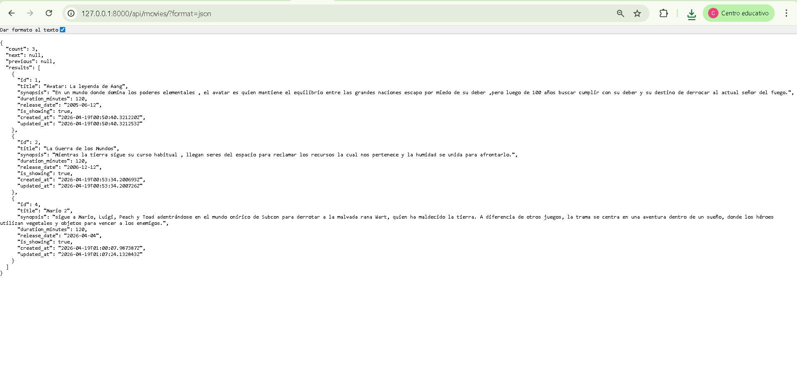

# 🎬 Cinespoiler API

**Cinespoiler API** es una API REST desarrollada con **Django** y **Django REST Framework** para la gestión de películas dentro de un sistema de cine.

El proyecto fue construido con una estructura clara, limpia y escalable, sirviendo como una base sólida para futuras mejoras y la incorporación de nuevos módulos.

---

## 📖 Descripción del proyecto

Esta API permite realizar operaciones CRUD sobre películas, facilitando su administración desde distintos puntos del sistema.

Entre sus funcionalidades principales se encuentran:

- Registrar nuevas películas
- Listar todas las películas registradas
- Consultar el detalle de una película específica
- Actualizar información de películas existentes
- Eliminar películas
- Gestionar registros desde el panel de **Django Admin**
- Consumir los endpoints desde la interfaz navegable de **Django REST Framework**

---

## 🚀 Tecnologías utilizadas

- **Python**
- **Django**
- **Django REST Framework**
- **SQLite**
- **Git**
- **GitHub**

---

## 🖼️ Capturas del proyecto

### API Root


### Formulario de registro de películas


### Edición de películas


### Listado de películas


### Listado de películas en formato JSON


---

## 📂 Estructura principal del proyecto

```bash
Cinespoiler/
├── .gitignore
├── manage.py
├── README.md
├── requirements.txt
├── config/
│   ├── __init__.py
│   ├── asgi.py
│   ├── settings.py
│   ├── urls.py
│   └── wsgi.py
└── movies/
    ├── __init__.py
    ├── admin.py
    ├── apps.py
    ├── migrations/
    ├── models.py
    ├── serializers.py
    ├── tests.py
    ├── urls.py
    └── views.py