# 🎬 Cinespoilers API

**Cinespoilers API** es una API REST desarrollada con **Django** y **Django REST Framework** para la gestión de películas y géneros en un sistema de cine.

El proyecto permite administrar películas, registrar géneros cinematográficos y relacionar una película con varios géneros mediante una relación muchos a muchos.

Además, cuenta con el panel administrativo de Django y con la interfaz navegable de Django REST Framework para probar los endpoints de forma visual.

> Proyecto colaborativo **Carlos Carbajal**, **Sarai Soto** y **Eduardo Quiquia**

---

## 📌 Tabla de contenido

- [Descripción general](#-descripción-general)
- [Objetivos del proyecto](#-objetivos-del-proyecto)
- [Funcionalidades principales](#-funcionalidades-principales)
- [Tecnologías utilizadas](#-tecnologías-utilizadas)
- [Capturas del proyecto](#-capturas-del-proyecto)
- [Endpoints principales](#-endpoints-principales)
- [Evidencias de endpoints](#-evidencias-de-endpoints)
- [Ejemplos de uso](#-ejemplos-de-uso)
- [Estructura del proyecto](#-estructura-del-proyecto)
- [Instalación y ejecución](#-instalación-y-ejecución)
- [Estado actual](#-estado-actual)
- [Posibles mejoras](#-posibles-mejoras)
- [Autor](#-autor)

---

## 📖 Descripción general

**Cinespoilers API** es una solución backend enfocada en la administración de películas dentro de un sistema de cine.

Permite registrar, consultar, actualizar y eliminar películas mediante endpoints REST. También permite registrar géneros cinematográficos como acción, drama, terror o comedia, y asociarlos a una o varias películas.

El proyecto utiliza **Django REST Framework**, lo que facilita la creación de una API limpia, ordenada y fácil de probar desde el navegador.

---

## 🎯 Objetivos del proyecto

Los principales objetivos de este proyecto son:

- Desarrollar una API REST funcional usando Django y Django REST Framework.
- Aplicar operaciones CRUD sobre películas.
- Crear una entidad `Genre` para administrar géneros.
- Relacionar `Movie` y `Genre` mediante una relación muchos a muchos.
- Utilizar serializers para transformar datos entre objetos Python y JSON.
- Gestionar datos desde el panel administrativo de Django.
- Probar los endpoints desde la Browsable API.
- Mantener una base simple y ordenada para futuras mejoras.

---

## ⚙️ Funcionalidades principales

Actualmente, el sistema permite:

- Registrar nuevas películas.
- Listar todas las películas.
- Consultar el detalle de una película.
- Editar información de películas.
- Eliminar películas.
- Registrar géneros.
- Listar géneros disponibles.
- Consultar el detalle de un género.
- Editar y eliminar géneros.
- Relacionar una película con varios géneros.
- Gestionar películas y géneros desde el panel de administración.
- Consumir la API desde la interfaz navegable de Django REST Framework.
- Obtener respuestas en formato JSON.

---

## 🚀 Tecnologías utilizadas

Este proyecto fue desarrollado con las siguientes tecnologías:

- Python
- Django
- Django REST Framework
- SQLite
- Git
- GitHub

---

## 🖼️ Capturas del proyecto

A continuación, se muestran capturas del funcionamiento en diferentes perspectivas.

## Carlos Carbajal 

### Panel de administración

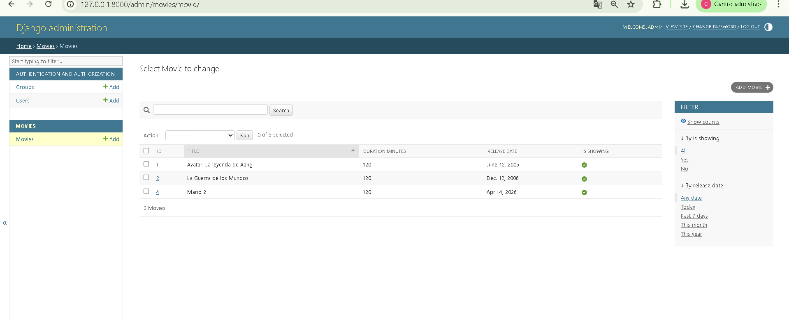

### Listado de géneros

### Detalle de género

### Respuesta JSON de géneros

### Listado de películas

### Detalle de película

### Respuesta JSON de películas

---

## 🖼️ Evidencias de endpoints

En esta sección se muestran las capturas de las pruebas realizadas en los endpoints de la API.

### 1. POST Genre

Permite crear un nuevo género.

---

### 2. GET Movie con relación de géneros

Permite visualizar una película junto con sus géneros relacionados.

---

### 3. POST Movie

Permite crear una nueva película y relacionarla con géneros existentes.

---

### 4. GET Movie

Permite listar las películas registradas.

---

### 5. PUT Movie

Permite actualizar completamente la información de una película.

---

### 6. Detalle de Movie

Permite consultar la información de una película específica.

# Eduardo Quiquia - Evidencias

## Listar peliculas
** Ruta: GET /api/movies/
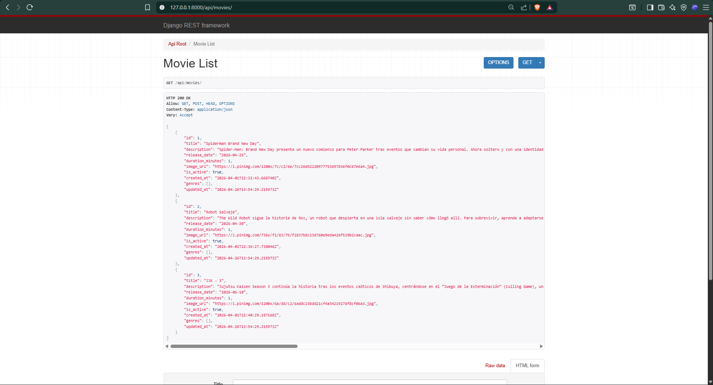

## Crear pelicula
**Ruta: POST /api/movies/
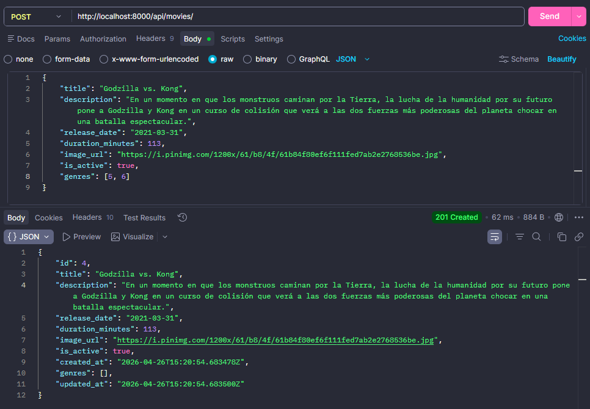

## Actualizar pelicula
**Ruta: PUT /api/movies/4
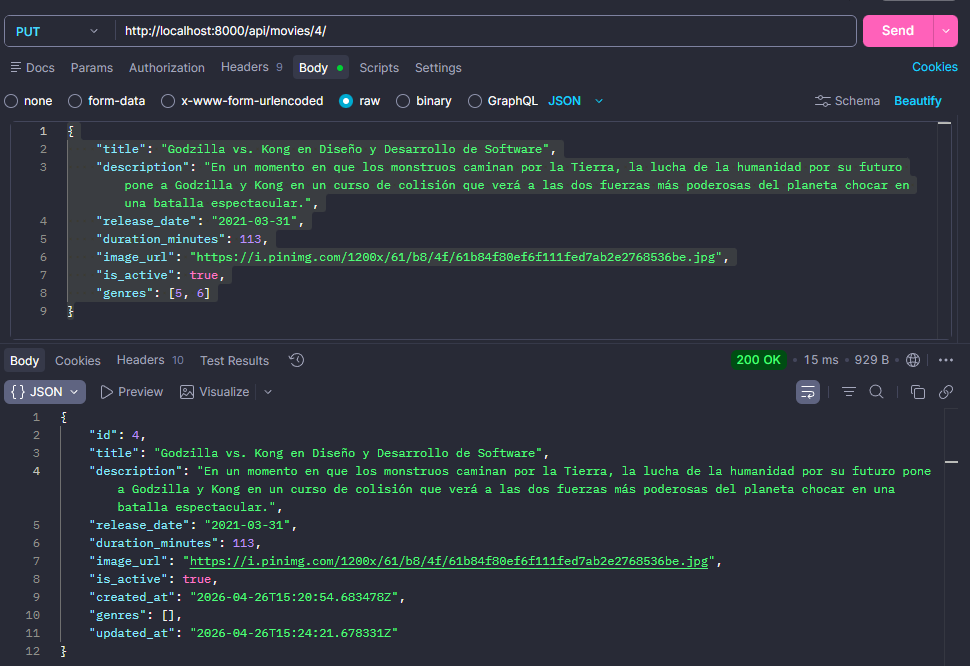

## Eliminar pelicula
**Ruta: DELETE /api/movies/4
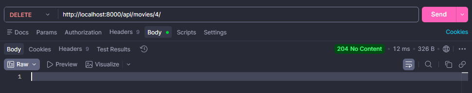

## Data Base - MOVIES
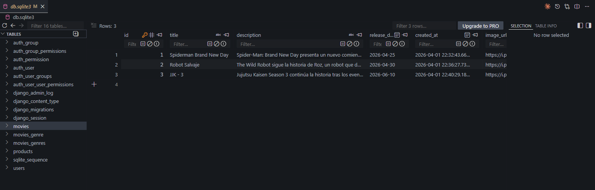

## Listar genres
** Ruta: GET /api/genres/
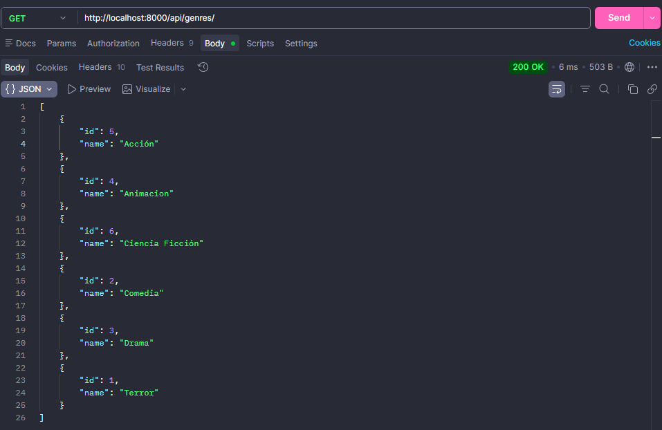

## Crear genres
**Ruta: POST /api/genres/
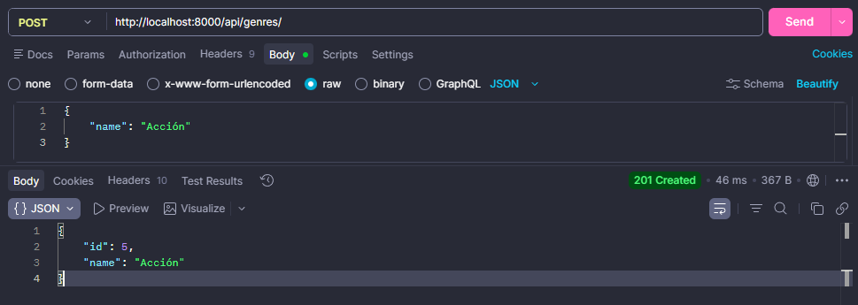
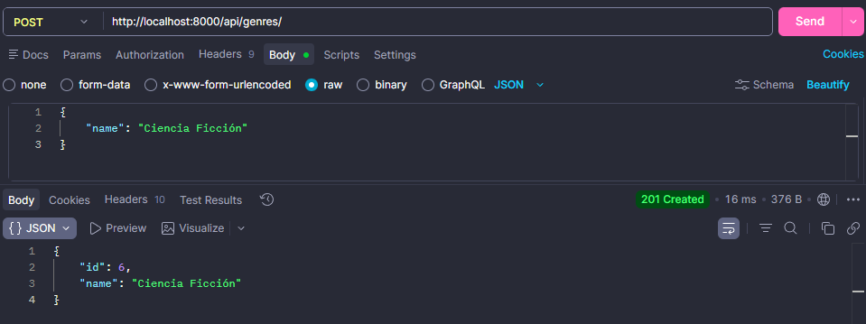

## Actualizar genre
**Ruta: PUT /api/genres/1
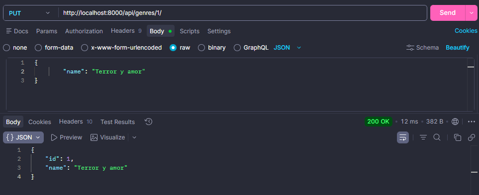

## Eliminar genre
**Ruta: DELETE /api/genres/1
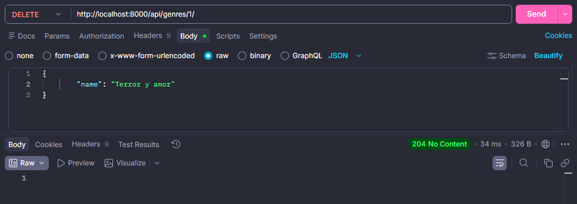

## Data Base - MOVIES
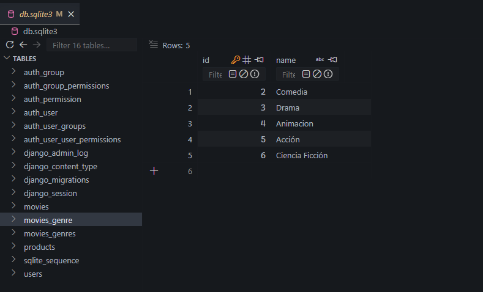